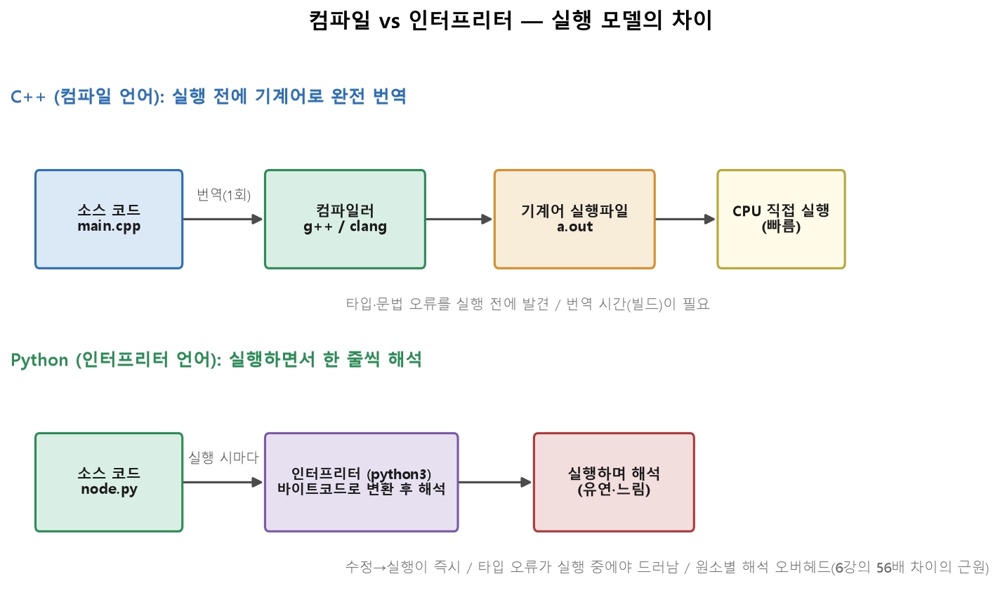
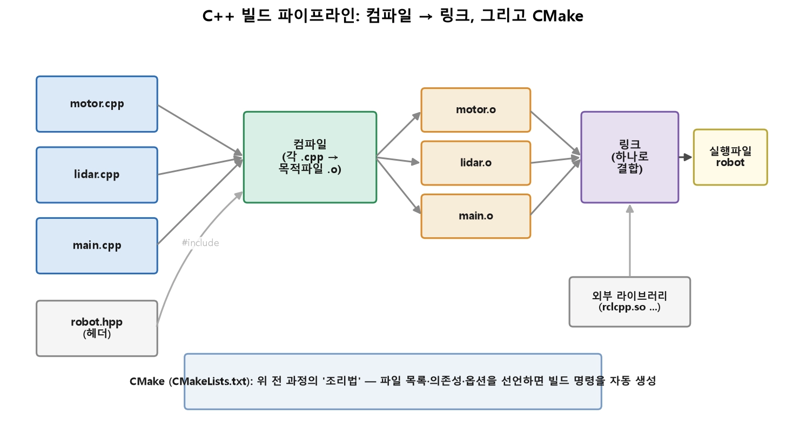

*** Numpy 벡터 연산
* 가상의 LiDAR 스캔에서 유효 측정
* 최근접 장애물의 거리와 각도를 찾기
* 극좌표를 직교좌표로 한 번에 변환
* 전방 위험 구간을 판정
* 반복문 버전과 벡터화 버전의 속도를 비교

** 준비 코드
<pre><code>
import sys
sys.path.append('../src')          # src/ 의 모듈을 불러오기 위한 경로

import numpy as np
import matplotlib.pyplot as plt

%matplotlib inline
%load_ext autoreload
%autoreload 2

print('실행 중인 파이썬:', sys.executable)   # .venv 경로가 맞는지 확인!


# ── 자가 채점 도우미 ──────────────────────────────
_score = {}

def check(label, ok, hint=''):
    """조건 하나를 확인하고 결과를 출력한다."""
    ok = bool(ok)
    print(('  PASS  ' if ok else '  FAIL  ') + label
          + ('' if ok else '   ->  ' + hint))
    return ok

def grade(no, *conds):
    """문항 하나의 채점 결과를 기록한다."""
    _score[no] = all(conds)
    print(f"[문항 {no}] {'통과' if _score[no] else '미통과'}")

def summary():
    """전체 통과 현황을 요약한다."""
    passed = sum(_score.values())
    print(f'통과 {passed} / 시도 {len(_score)} 문항')
    bad = [k for k, v in _score.items() if not v]
    print('다시 볼 문항:', ', '.join(map(str, bad)) if bad else '없음')


rng    = np.random.default_rng(0)          # 시드 고정 - 재현 가능한 실습
scan   = rng.random(360) * 12              # 각도별 거리 [m], 0~12
angles = np.linspace(0, 2*np.pi, 360)      # 각 측정의 각도 [rad]

print('scan  :', scan.shape, scan.dtype)
print('angles:', angles.shape)
print('처음 5개 거리:', np.round(scan[:5], 3))
</code></pre>


## 문항 1. 유효 측정만 남기기

**목표** — 센서 사양을 벗어난 측정을 걸러낸다.

**주어진 것**

- `scan` — 거리 배열 (360,)

**구현할 것**

- `mask` — 0.1 m 초과 **그리고** 10 m 미만인 곳이 True 인 불리언 배열 (360,)
- `valid` — 유효한 거리만 남긴 1차원 배열
- `ratio` — 유효 측정의 비율 (0~1 사이 실수)

**기대 결과**

```
valid.shape -> (247,)
유효 비율 -> 0.686
```

> **힌트**: 복합 조건은 `&` 로 잇고 **각 조건을 괄호로 감싸야** 합니다. 비율은 `mask.mean()` 한 줄로도 됩니다.

> ** 참고 — 이 문항에서 쓰는 기능**
> - `scan > 0.1`, `scan < 10.0` — 배열과 스칼라를 비교해 불리언 배열을 반환 (브로드캐스팅)
> - `&` — 불리언 배열끼리의 원소별 AND. 파이썬의 `and`는 배열에 못 쓰고 `&`를 써야 하며, 연산자 우선순위 때문에 각 비교식을 **괄호**로 감싸야 함
> - `arr[mask]` (불리언 인덱싱) — `mask`에서 `True`인 위치의 값만 골라 새 배열 생성
> - `mask.mean()` — 불리언 배열을 내부적으로 0/1로 취급해 평균을 내면 `True`의 비율이 됨

<pre><code>
mask  = (scan > 0.1) & (scan < 10.0)
valid = scan[mask]
ratio = mask.mean()

print(valid.shape, f'유효 비율 {ratio:.3f}')
</code></pre>

<pre><code>
# ── 자가 채점 (이 셀은 수정하지 마세요) ──
_m = (scan > 0.1) & (scan < 10.0)
grade(1,
      check('mask 가 불리언 배열', getattr(mask, 'dtype', None) == bool,
            '비교 연산 결과를 그대로 담으세요'),
      check('mask 의 내용이 정확', np.array_equal(mask, _m),
            '0.1 초과 AND 10 미만 - 등호 포함 여부와 괄호를 확인하세요'),
      check('valid 가 1차원', np.ndim(valid) == 1),
      check('valid 의 내용이 정확', np.array_equal(valid, scan[_m])),
      check('ratio 가 정확', np.isclose(ratio, _m.mean()),
            'ratio = 유효 개수 / 전체 개수'))
</code></pre>


### 문항 2. 최근접 장애물

**목표** — 유효 측정 중 가장 가까운 것의 거리와 그 각도를 찾는다.

**주어진 것**

- `valid`, `mask`, `angles`

**구현할 것**

- `near_dist` — 최소 거리 [m] (스칼라)
- `near_deg` — 그 측정의 각도 [deg], 0~360 범위

**기대 결과**

```
최근접 0.101 m @ 265.7 deg
```

> **힌트**: `np.argmin(valid)` 는 **valid 안에서의 위치**입니다. 원래 각도를 찾으려면 `angles[mask]` 로 각도도 같이 걸러 두고 같은 인덱스를 쓰세요.

> ** 참고 — 이 문항에서 쓰는 기능**
> - `arr.min()` — 배열의 최솟값
> - `np.argmin(arr)` — 최솟값의 **인덱스(위치)** 를 반환 (값 자체가 아님)
> - `angles[mask]` — 같은 마스크로 각도 배열도 걸러서 `valid`와 순서(인덱스)를 맞춤
> - `np.degrees(rad)` — 라디안 → 도(°) 단위로 변환

<pre><code>
near_dist = valid.min()      # TODO
near_deg  = np.degrees(angles[mask][np.argmin(valid)])      # TODO   (도 단위)

print(f'최근접 {near_dist:.3f} m @ {near_deg:.1f} deg')
</code></pre>

<pre><code>
# ── 자가 채점 (이 셀은 수정하지 마세요) ──
_i = np.argmin(scan[_m])
grade(2,
      check('near_dist 가 최솟값', np.isclose(near_dist, scan[_m].min())),
      check('near_deg 가 그 측정의 각도',
            np.isclose(near_deg, np.degrees(angles[_m][_i])),
            '무효 측정을 걸러낸 뒤의 인덱스를 각도에도 똑같이 적용하세요'),
      check('near_deg 가 0~360 범위', 0 <= near_deg <= 360))
</code></pre>


### 문항 3. 극좌표 → 직교좌표 (반복문 금지)

**목표** — 유효 측정 전부를 로봇 중심 직교좌표로 옮긴다.

**주어진 것**

- `valid` (유효 거리), `mask`, `angles`

**구현할 것**

- `xy` — shape `(N, 2)` 배열. 각 행이 `[x, y]`
- `x = r·cos(θ)`, `y = r·sin(θ)`

**기대 결과**

```
xy.shape -> (247, 2)
```

> **힌트**: `np.column_stack([x, y])` 또는 `np.stack([x, y], axis=1)`. **for 문을 쓰면 이 문항은 통과해도 목적을 놓친 것입니다.**

> ** 참고 — 이 문항에서 쓰는 기능**
> - `np.cos(theta)`, `np.sin(theta)` — 배열 전체에 원소별로 적용되는 삼각함수 (반복문 없이 벡터화)
> - `np.column_stack([a, b])` — 1차원 배열 여러 개를 열(column)로 나란히 붙여 2차원 배열 생성. `np.stack([a, b], axis=1)`과 동일

<pre><code>
ang_valid = angles[mask]     # TODO: 유효 측정의 각도만
xy        = np.column_stack([valid * np.cos(ang_valid), valid*np.sin(ang_valid)])    # TODO: (N, 2)

print(xy.shape)
print(np.round(xy[:3], 3))
</code></pre>

<pre><code>
# ── 자가 채점 (이 셀은 수정하지 마세요) ──
_r, _a = scan[_m], angles[_m]
_xy = np.column_stack([_r*np.cos(_a), _r*np.sin(_a)])
grade(3,
      check('xy 의 shape 가 (N, 2)', np.shape(xy) == _xy.shape,
            f'{_xy.shape} 가 나와야 합니다'),
      check('xy 의 값이 정확', np.allclose(xy, _xy),
            'x 는 cos, y 는 sin 입니다. 열 순서를 확인하세요'),
      check('원점까지 거리가 보존됨',
            np.allclose(np.linalg.norm(xy, axis=1), _r),
            '변환은 길이를 바꾸지 않아야 합니다'))
</code></pre>


### 문항 4. 전방 위험 구간 판정

**목표** — 로봇 전방 ±30° 안에 1.5 m 이내 장애물이 있으면 정지 판정을 낸다.

**주어진 것**

- `valid`, `ang_valid` (문항 3에서 만든 유효 각도)

**구현할 것**

- `front` — 각도가 전방 ±30° 안인 곳이 True 인 마스크
- `danger` — 전방이면서 1.5 m 이내인 곳이 True 인 마스크
- `stop` — 위험이 하나라도 있으면 True (파이썬 bool)

**기대 결과**

```
전방 위험 측정 12개 -> 정지
```

> **힌트**: 각도는 0~2π 범위입니다. 전방 ±30° 는 `θ < π/6` **또는** `θ > 2π - π/6` 두 구간으로 나뉩니다. `|` 로 잇고 괄호에 주의하세요. 마지막은 `.any()`.

> ** 참고 — 이 문항에서 쓰는 기능**
> - `|` — 불리언 배열끼리의 원소별 OR (`&`=AND 와 짝을 이룸)
> - `&` — 원소별 AND (문항 1 참고)
> - `arr.any()` — 배열에 `True`가 하나라도 있으면 `True` 반환
> - `bool(x)` — numpy 불리언(`np.bool_`)을 파이썬 기본 `bool`로 변환

<pre><code>
front  = (ang_valid < np.pi/6) | (ang_valid > np.pi*2 - np.pi/6)
danger = front & (valid < 1.5)
stop   = bool(danger.any())

print(f'전방 위험 측정 {danger.sum()}개 -> ' + ('정지' if stop else '주행'))
</code></pre>

<pre><code>
# ── 자가 채점 (이 셀은 수정하지 마세요) ──
_f = (_a < np.pi/6) | (_a > 2*np.pi - np.pi/6)
_d = _f & (_r < 1.5)
grade(4,
      check('front 마스크가 정확', np.array_equal(front, _f),
            '0 근처와 2pi 근처 두 구간을 OR 로 이어야 합니다'),
      check('danger 마스크가 정확', np.array_equal(danger, _d)),
      check('stop 이 bool', isinstance(bool(stop), bool)),
      check('stop 판정이 정확', bool(stop) == bool(_d.any())))
</code></pre>


### 문항 5. 시각화

**목표** — 위 결과를 한 그림으로 확인한다.

**그릴 것**

- 유효 측정 전체를 회색 점으로
- 위험 구간 측정을 빨간 점으로
- 로봇 위치(원점)를 삼각형 마커로
- `ax.set_aspect('equal')` 로 축 비율을 맞출 것

> 이 문항은 자동 채점 대신 눈으로 확인합니다. 6강 본문의 `06_lidar_극좌표.png` 오른쪽 그림과 비슷하면 성공입니다.

> ** 참고 — 이 문항에서 쓰는 기능**
> - `ax.scatter(x, y, ...)` — 산점도. `c`=색, `s`=마커 크기, `label`=범례 이름
> - `xy[danger, 0]` — 불리언 배열로 2차원 배열의 **행**을 골라낸 뒤 0번째 열(x좌표)만 선택
> - `ax.set_aspect('equal')` — x/y 축 스케일을 1:1로 맞춤 (원·각도가 찌그러지지 않게)
> - `ax.legend()` — `scatter`에 준 `label`들을 모아 범례로 표시

<pre><code>
fig, ax = plt.subplots(figsize=(5.5, 5.5))
ax.scatter(xy[:, 0], xy[:, 1], s=10, c='gray', label='valid')
ax.scatter(xy[danger, 0], xy[danger, 1], s=20, c='red', label='danger')
ax.scatter(0, 0, marker='^', c='blue', s=100, label='robot')

ax.set_aspect('equal')
ax.set_xlabel('x [m]'); ax.set_ylabel('y [m]')
ax.legend()
plt.show()**측정 결과**: (몇 배 차이가 났는지, 그리고 데이터가 100배 커지면 어떻게 될지 적으세요.)
</code></pre>


### 문항 6. 회전은 길이를 바꾸지 않는다

**목표** — 점군 전체를 z축 45° 회전시키고, 원점까지의 거리가 보존되는지 확인한다.

**주어진 것**

- `xy` — (N, 2) 점군

**구현할 것**

- `R` — 2×2 회전행렬 (45°)
- `xy_rot` — 회전된 (N, 2) 점군

**기대 결과**

```
회전 전후 거리 최대 차이 -> 0.0 (부동소수점 오차 수준)
```

> **힌트**: 점이 **행**으로 쌓여 있으므로 `xy @ R.T` 입니다(6강 브로드캐스팅 절). `R @ xy` 는 shape 가 맞지 않습니다.

> ** 참고 — 이 문항에서 쓰는 기능**
> - `np.radians(deg)` — 도(°) → 라디안 변환
> - `np.array([[..], [..]])` — 중첩 리스트로 2차원 배열(행렬) 생성
> - `@` — 행렬 곱 연산자 (`np.matmul`과 동일). 원소별 곱셈인 `*`와 다름
> - `.T` — 배열의 전치(행↔열 교환)
> - `np.linalg.norm(v, axis=1)` — 각 행 벡터의 길이(유클리드 노름) 계산. `axis=1`은 "행마다" 계산하라는 뜻

<pre><code>
th = np.radians(45)
R  = np.array(
    [[np.cos(th), -np.sin(th)],
    [np.sin(th), np.cos(th)]]
)
xy_rot = xy @ R.T
d0 = np.linalg.norm(xy, axis=1)
d1 = np.linalg.norm(xy_rot, axis=1)
print('거리 최대 차이:', np.abs(d0 - d1).max())
</code></pre>

<pre><code>
# ── 자가 채점 (이 셀은 수정하지 마세요) ──
_c, _s = np.cos(np.radians(45)), np.sin(np.radians(45))
_R = np.array([[_c, -_s], [_s, _c]])
grade(6,
      check('R 이 2x2', np.shape(R) == (2, 2)),
      check('R 이 45도 회전행렬', np.allclose(R, _R),
            '[[cos, -sin], [sin, cos]] 순서를 확인하세요'),
      check('xy_rot 의 shape 가 유지됨', np.shape(xy_rot) == np.shape(xy)),
      check('회전이 길이를 보존', np.allclose(d0, d1),
            '길이가 변했다면 곱하는 순서나 전치를 확인하세요'))
</code></pre>


### 문항 7. 반복문 vs 벡터화 속도 비교

**목표** — 6강 본문의 속도 차이를 직접 측정한다.

**할 것**

1. 문항 1의 전처리를 **for 문 버전**으로 작성한다 (`loop_filter`)
2. `%timeit` 으로 두 버전의 시간을 각각 잰다
3. 몇 배 차이인지 아래 마크다운 셀에 적는다

> ** 참고 — 이 문항에서 쓰는 기능**
> - 파이썬 `for` 반복문 — 원소를 하나씩 순회 (numpy 벡터화와 대조되는 방식)
> - `list.append(x)` — 파이썬 리스트에 원소 추가
> - `np.array(list)` — 파이썬 리스트를 numpy 배열로 변환
> - `%timeit` — 셀/구문을 여러 번 반복 실행해 평균·표준편차 실행 시간을 재는 Jupyter 매직 명령어

<pre><code>
def loop_filter(scan):
    """for 문으로 유효 측정만 골라내기 (비교용)"""
    out = []
    for v in scan:
        if 0.1 < v < 10.0:
            out.append(v)
    return np.array(out)

print(np.array_equal(loop_filter(scan), scan[mask]))   # True 여야 합니다
print(20.5/1.31)
</code></pre>

<pre><code>
%timeit loop_filter(scan)
%timeit scan[(scan > 0.1) & (scan < 10.0)]
</code></pre>

**측정 결과**: (몇 배 차이가 났는지, 그리고 데이터가 100배 커지면 어떻게 될지 적으세요.)

* 15.6 배
* 100배 커지면 메모리 접근이 360번에 36000번으로 늘어난다.


*** 7강. 컴파일 vs 인터프리터, C++ 빌드 시스템 (g++·CMake)

* 탐색·프로토타이핑·인지 스크립트는 Python, 제어 루프·드라이버·성능이 필요한 노드는 C++.

** 1. 두 실행 모델


* C++은 실행 전에 컴파일러가 소스 전체를 기계어 실행파일로 번역합니다. 실행 시점에는 CPU가 기계어를 직접 돌리므로 최고 속도가 납니다.
* Python은 실행 하면서 인터프리터가 한 줄씩 해석합니다. 수정 후 바로 실행할 수 있어 개발이 빠르지만, 매 실행마다 해석 비용을 지불합니다.


* 타입 검사 시점: C++은 컴파일 때 모든 변수의 타입이 확정됩니다. Python은 실행 중 매 연산마다 "이 객체가 뭐지?"를 확인합니다(동적 타이핑의 비용).
* 메모리 배치: C++의 double x는 8바이트 그 자체입니다. Python의 x = 1.0은 타입 정보·참조 카운트가 붙은 객체라 크고 흩어져 있습니다.
* 최적화: 컴파일러는 전체 코드를 보고 인라인 확장, 루프 최적화, SIMD 벡터화까지 수행합니다. 인터프리터는 한 줄 단위라 이런 전역 최적화가 어렵습니다.

|관점|C++ (컴파일)|Python (인터프리터)|
|:-------:|:-----------------:|:-----------------------------:|
|실행 속도|최고 수준|수십~수백 배 느림 (원소 연산 기준)|
|개발 속도|빌드 대기, 엄격한 문법|수정→실행 즉시|
|오류 발견|실행 전 (컴파일 에러)|실행 중 (그 줄에 도달해야)|
|메모리 제어|직접 제어 (8강)|자동 관리 (GC)|
|배포물|기계어 실행파일|소스 + 인터프리터 필요|

* Python으로 먼저 검증하고, 병목과 실시간 경로만 C++로.

* Python도 컴파일을 합니다 — 다만 기계어가 아니라 바이트코드(.pyc)로. 이 바이트코드를 파이썬 가상머신(PVM)이 해석합니다. "인터프리터 언어"라는 말은 정확히는 "기계어로 미리 컴파일하지 않는 언어"입니다.
* JIT(Just-In-Time) 컴파일: 실행 중 자주 도는 코드(핫스팟)를 그 자리에서 기계어로 컴파일하는 기법. PyPy, 그리고 numba(@njit 데코레이터 하나로 파이썬 함수를 기계어로)가 대표적입니다. 자바·자바스크립트가 빠른 이유도 JIT입니다.
* Cython / pybind11: 성능이 필요한 부분만 C/C++로 쓰고 Python에서 불러 쓰는 다리. NumPy·OpenCV·PyTorch가 전부 이 구조


** 2. 첫 C++ 프로그램 — Python과 나란히 보기

<pre><code>
// stop_distance.cpp
#include <iostream>     // 입출력 라이브러리 (Python의 import 격)

double computeStopDistance(double speed, double decel = 1.5) {
    return speed * speed / (2.0 * decel);
}

int main() {                             // 프로그램의 시작점 (필수)
    double v = 1.2;                      // 타입을 반드시 선언
    std::cout << "정지거리: "
              << computeStopDistance(v)
              << " m" << std::endl;
    return 0;                            // 0 = 정상 종료
}
</code></pre>

* 모든 변수·함수에 타입 명시 — double v. 5강의 타입 힌트가 여기선 힌트가 아니라 강제입니다.
* main() 함수가 시작점 — 스크립트 위에서부터 실행되는 Python과 달리, 실행 흐름의 입구가 하나로 고정됩니다.
* 중괄호 {}와 세미콜론 ; — 들여쓰기는 사람을 위한 것이고, 문법 구조는 기호가 정합니다.
* std:: — 표준 라이브러리의 네임스페이스(Python의 모듈 접두 np.와 같은 역할).

g++ -o stop_distance stop_distance.cpp   # 번역 (빌드)
./stop_distance                          # 실행

* g++에 자주 쓰는 옵션은 습관으로 만들어 두세요:
g++ -Wall -Wextra -O2 -std=c++17 -o robot main.cpp
#   ─┬──────────  ─┬─  ─┬────────
#    │             │    └ 언어 표준 지정 (ROS2 Humble은 C++17)
#    │             └ 최적화 레벨 2 (배포용; 디버깅 때는 -g)
#    └ 모든 경고 켜기 — 경고는 미래의 버그 목록입니다


** 3. 프로그램이 커지면 — 헤더/소스 분리와 빌드 파이프라인
 - 파일 하나로는 로봇 소프트웨어를 만들 수 없습니다. C++은 코드를 헤더(.hpp)와 소스(.cpp) 로 나눕니다.
* 헤더(.hpp): 선언(declaration) — "이런 함수/클래스가 존재한다"는 목록. 다른 파일이 #include로 참조합니다.
* 소스(.cpp): 정의(definition) — 실제 구현 코드.
<pre><code>
// motor.hpp — 선언 (인터페이스)
#pragma once                      // 중복 include 방지
class Motor {
public:
    void setSpeed(double mps);    // "이런 기능이 있다"만 알림
private:
    double current_speed_ = 0.0;
};
</code></pre>

<pre><code>
// motor.cpp — 정의 (구현)
#include "motor.hpp"
void Motor::setSpeed(double mps) {
    current_speed_ = mps;         // 실제 동작
}
</code></pre>

* 컴파일 단위의 독립 때문입니다. main.cpp는 motor.hpp(선언)만 알면 컴파일할 수 있고, motor.cpp의 구현이 바뀌어도 main.cpp는 다시 컴파일할 필요가 없습니다. 수백 개 파일의 프로젝트에서 이 분리가 빌드 시간을 지배합니다.


- 해석: 각 .cpp가 독립적으로 컴파일되어 목적파일(.o)이 되고, 링커가 이들을 외부 라이브러리(rclcpp 등)와 함께 하나의 실행파일로 결합합니다. 헤더는 컴파일 때 #include로 텍스트처럼 끼워 넣어집니다. 맨 아래 CMake는 이 전 과정을 자동화하는 조리법입니다.

# 수동으로 하면 이렇게 됩니다
g++ -c motor.cpp -o motor.o      # -c: 컴파일만 (링크 안 함)
g++ -c lidar.cpp -o lidar.o
g++ -c main.cpp  -o main.o
g++ motor.o lidar.o main.o -o robot   # 링크


** 4. CMake — 빌드의 조리법
- 파일이 몇 개만 넘어가도 수동 g++ 명령은 유지 불가능합니다. 표준 해법이 CMake — "무엇을 어떻게 빌드할지"를 선언하면 플랫폼에 맞는 빌드 절차를 생성해 주는 도구입니다.
<pre><code>
# CMakeLists.txt
cmake_minimum_required(VERSION 3.16)
project(robot_controller CXX)

set(CMAKE_CXX_STANDARD 17)             # C++17 사용

add_executable(robot                    # 실행파일 robot을
    src/main.cpp                        # 이 소스들로 만든다
    src/motor.cpp
    src/lidar.cpp
)
target_include_directories(robot PRIVATE include)   # 헤더 위치
# target_link_libraries(robot PRIVATE rclcpp::rclcpp)  # 외부 라이브러리 (ROS2에서)
</code></pre>
<pre><code>
mkdir build && cd build
cmake ..        # 조리법 해석 → 빌드 절차 생성
make            # 실제 빌드 (바뀐 파일만 다시 컴파일!)
./robot
</code></pre>

* 증분 빌드: motor.cpp만 고치면 motor.o만 다시 컴파일합니다. 대형 프로젝트에서 수 분 → 수 초.
* 의존성 선언: "robot은 rclcpp가 필요하다"를 선언하면, 헤더 경로·링크 설정을 CMake가 알아서 풉니다.

링크되는 라이브러리는 두 형태가 있습니다.

||정적 (.a)|동적 (.so)|
|:--------------:|:--------------------:|:---------------------:|
|결합 시점|링크 때 실행파일 안에 복사|실행 시점에 메모리에서 연결|
|실행파일 크기|커짐|작음|
|라이브러리 업데이트|재빌드 필요|.so 교체만으로 반영|
|배포|파일 하나로 끝|.so가 시스템에 있어야 함|

- ROS2의 rclcpp는 동적 라이브러리(librclcpp.so)입니다. 그래서 ROS2 노드를 실행할 때 source setup.bash(3강)로 라이브러리 경로(LD_LIBRARY_PATH)를 잡아 주지 않으면 "cannot open shared object file" 에러가 납니다 — 이제 이 에러의 정체를 설명할 수 있습니다: 실행 시점 링크가 .so를 못 찾은 것입니다.


