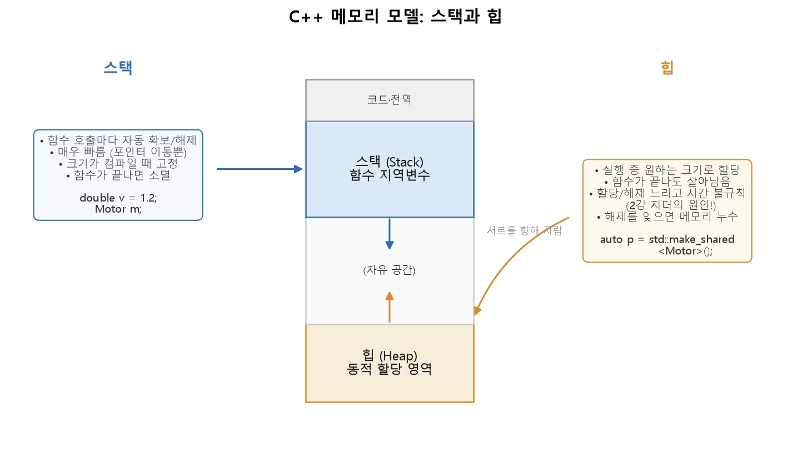
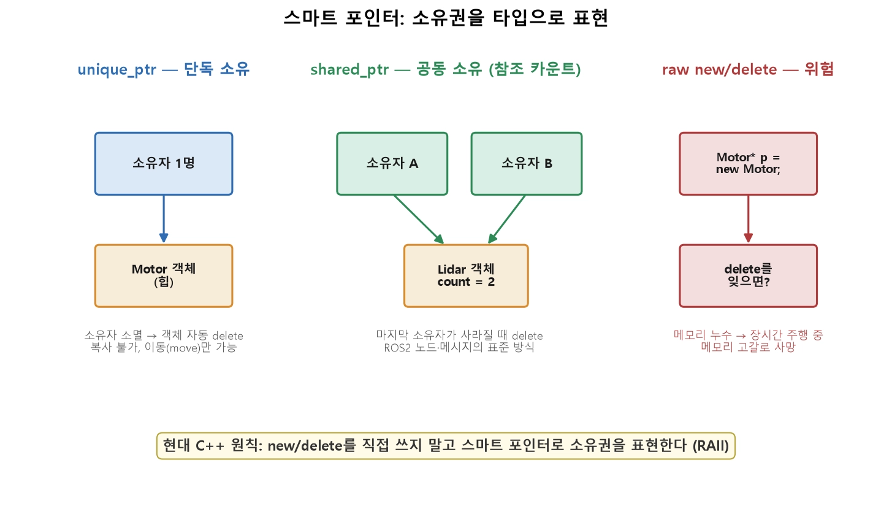

** test

* 컴파일러 설치
* sudo apt install -y build-essential cmake gdb valgrind git
* 
* g++ -Wall -Wextra -std=c++17 -o hello ./hello_world.cpp
* a
* a
* a
* float f_number = 3.14f; # 3.14f f는 literal(리터럴)
* a
* a
* a
* a

** 1. 스택과 힙
* 스택은 함수의 지역 변수가 사는 곳입니다. 함수에 들어갈 때 자동으로 확보되고 나갈 때 자동으로 사라지며, 포인터만 움직이면 되니 매우 빠릅니다. 힙은 실행 중에 원하는 크기로 할당하는 자유 영역입니다. 함수가 끝나도 살아남지만, 할당·해제가 느리고 시간이 불규칙합니다(2강의 지터 원인!). 그리고 해제를 잊으면 메모리 누수가 됩니다.
  
<pre><code>
void control_loop() {
    double target = 0.5;          // 스택: 함수 끝나면 자동 소멸
    Motor m;                      // 스택: m도 자동 소멸

    // 힙: 실행 중 크기가 정해지는 데이터
    std::vector<double> scan(360);  // 내부 데이터는 힙, vector 객체는 스택
}   // 여기서 target, m, scan 모두 자동 정리됨
</code></pre>
 - 핵심 원칙: 가능하면 스택을 쓰세요. 빠르고, 자동으로 정리되고, 누수가 없습니다. 힙이 정말 필요할 때만 — 그리고 그때는 스마트 포인터로 씁니다(아래).

** 2. 포인터와 참조
 - C++에서 큰 데이터를 함수에 넘길 때 값을 통째로 복사하면 느립니다. 대신 주소를 넘깁니다.
<pre><code>
// 값 전달: 360개를 통째로 복사 (느림)
double process(std::vector<double> scan);

// 참조 전달: 원본을 가리킴, 복사 없음 (& = 참조)
double process(const std::vector<double>& scan);   // const = 못 바꿈(읽기 전용)
</code></pre>
* 참조(&): 기존 객체의 별명. 항상 유효한 무언가를 가리키며, 문법이 값처럼 자연스럽습니다. 함수 인자로는 참조가 기본입니다.
* 포인터(*): 주소를 담는 변수. nullptr(아무것도 안 가리킴)일 수 있고, 가리키는 대상을 바꿀 수 있어 더 유연하지만 더 위험합니다.
 - const &(const 참조)로 넘기는 것이 로봇 코드의 표준 관용구입니다 — 복사 비용 없이, 원본 보호까지 동시에 얻습니다.

* raw 포인터의 위험
 - 옛날 방식으로 힙을 직접 다루면 두 가지 참사가 기다립니다.
 - 이런 실수는 컴파일러가 잡아 주지 않습니다. 그래서 현대 C++은 아예 new/delete를 손으로 쓰지 않는 방향으로 진화했습니다.
<pre><code>
Motor* p = new Motor();    // 힙에 할당
// ... 사용 ...
// delete p;   ← 이걸 잊으면? 메모리 누수 (누적되면 로봇 사망)

Motor* q = new Motor();
delete q;
q->setSpeed(0.5);          // 이미 해제된 걸 사용 → 댕글링 포인터, 크래시
</code></pre>

** 3. RAII와 스마트 포인터
- 핵심 아이디어가 RAII(Resource Acquisition Is Initialization) 입니다. 이름은 어렵지만 뜻은 간단합니다 — "자원의 수명을 객체의 수명에 묶는다." 객체가 사라질 때 자원(메모리·파일·소켓)도 자동으로 정리되게 하는 것입니다. 스택 객체는 범위를 벗어나면 반드시 소멸되므로, 이 소멸에 정리를 걸어 두면 잊을 수가 없습니다.
- 이 원칙을 메모리에 적용한 것이 스마트 포인터입니다.

- unique_ptr는 객체를 단 한 명이 소유합니다 — 소유자가 사라지면 객체도 자동 삭제되고, 복사할 수 없어(이동만 가능) 소유권이 항상 명확합니다. shared_ptr는 여러 명이 공동 소유하며 참조 카운트를 셉니다 — 마지막 소유자가 사라질 때 삭제됩니다.
- 반면 raw new/delete는 delete를 잊으면 누수가 됩니다. 현대 C++의 원칙은 "new/delete를 직접 쓰지 말고 스마트 포인터로 소유권을 표현하라."
<pre><code>
#include <memory>

// unique_ptr — 단독 소유 (기본 선택)
auto motor = std::make_unique<Motor>();
motor->setSpeed(0.5);
// 함수 끝나면 자동 delete — 잊을 수가 없음

// shared_ptr — 공동 소유 (여러 곳에서 참조해야 할 때)
auto lidar = std::make_shared<Lidar>();
auto lidar2 = lidar;          // 참조 카운트 2로 증가
// 둘 다 사라지면 그때 delete
</code></pre>
- ROS2와의 직접 연결: ROS2에서 노드·발행자·구독자·메시지는 거의 전부 shared_ptr로 다뤄집니다.
- 선택 기준: 기본은 unique_ptr(소유자가 하나면 충분), 여러 주체가 공유해야 하면 shared_ptr. "그냥 다 shared_ptr"는 참조 카운트 관리 비용과 소유권 모호함을 부르므로 지양합니다.

** 4. 클래스와 다형성 — 가상 함수
- Python으로 배운 상속·다형성을 C++로 옮기면, 한 가지 명시적 장치가 추가됩니다 — 가상 함수(virtual) 입니다.
<pre><code>
class Sensor {
public:
    virtual ~Sensor() = default;          // 가상 소멸자 (상속 시 필수!)
    virtual std::vector<double> read() = 0;  // = 0: 순수 가상 (자식이 반드시 구현)
    bool isConnected() const { return connected_; }
protected:
    bool connected_ = false;
};

class Lidar : public Sensor {             // public 상속
public:
    std::vector<double> read() override {  // override: 재정의임을 명시
        return {0.8, 0.82, 0.85};
    }
};
</code></pre>
* virtual이 있어야 다형성이 작동합니다. C++은 성능을 위해 기본적으로 함수 호출을 정적으로 결정합니다. "부모 포인터로 자식 함수를 부르는" 다형성을 원하면 virtual을 명시해야 합니다.
* override 키워드: 재정의 의도를 명시하면, 실수(시그니처 오타 등)를 컴파일러가 잡아 줍니다. 항상 붙이세요.
* 가상 소멸자: 부모 포인터로 자식을 삭제할 때 자식 소멸자가 제대로 불리게 하려면 소멸자를 virtual로. 빠뜨리면 부분 소멸 누수가 납니다.
<pre><code>
std::vector<std::unique_ptr<Sensor>> sensors;
sensors.push_back(std::make_unique<Lidar>());
for (auto& s : sensors) {
    auto data = s->read();     // 다형성: 실제 타입의 read() 호출
}
</code></pre>

** 5. 템플릿 — 타입에 독립적인 코드
- 같은 로직을 int, double, Vector3에 대해 각각 복붙하는 것은 낭비입니다. 템플릿은 "타입을 매개변수로 받는" 코드를 쓰게 해 줍니다.
<pre><code>
template <typename T>
T clamp(T value, T lo, T hi) {        // 어떤 타입 T든 동작
    return std::max(lo, std::min(value, hi));
}

clamp(1.8, 0.0, 1.0);   // double → 1.0 (속도 상한)
clamp(150, 0, 255);     // int → 150 (픽셀값)
</code></pre>
- 컴파일러가 사용된 타입마다 전용 코드를 생성하므로, 유연하면서도 런타임 오버헤드가 없습니다(Python의 덕 타이핑과 결과는 비슷하나 성능은 정적). 이 템플릿 위에 세워진 것이 다음의 STL입니다.

** 6. STL — 표준 컨테이너와 알고리즘
- STL(Standard Template Library) 은 검증된 자료구조·알고리즘 모음입니다. 5강의 Python 자료구조와 거의 1:1로 대응합니다.
|용도|Python|C++ STL|
|:---:|:---:|:---:|
|순서|있는 배열|list|std::vector<T>|
|키→값 조회|dict|std::map / std::unordered_map|
|중복 없는 모음|set|std::set / std::unordered_set|
|고정 크기 묶음|tuple|std::array, std::tuple|
|문자열|str|std::string|

<pre><code>
#include <vector>
#include <unordered_map>
#include <algorithm>

std::vector<double> scan = {0.3, 8.2, 0.5, 12.0};
scan.push_back(1.1);                    // 끝에 추가
double closest = *std::min_element(scan.begin(), scan.end());  // 최솟값

std::unordered_map<std::string, double> sensors;   // dict 대응, 조회 O(1)
sensors["battery"] = 11.9;
if (sensors.count("battery")) { /* 존재 확인 */ }

// 범위 기반 for + 람다 (Python 컴프리헨션 느낌)
int near_count = std::count_if(scan.begin(), scan.end(),
                               { return d < 1.0; });
</code></pre>
 - vector는 6강의 NumPy ndarray처럼 연속 메모리라 캐시 효율이 좋습니다. 로봇 코드에서 가장 많이 쓰는 컨테이너이며, "특별한 이유가 없으면 vector"가 기본값입니다. 조회가 잦으면 unordered_map(해시, O(1)), 정렬 순서가 필요하면 map(트리, O(log n))을 씁니다 — 5강의 자료구조 선택 감각이 그대로 적용됩니다.

* 실시간 코드에서의 힙 할당과 vector 예약
  - 2강에서 "제어 루프 안에서 동적 할당을 피하라"고 했습니다. vector는 크기가 늘면 힙 재할당이 일어나 실행 시간이 튑니다(지터). Hard 실시간 루프에서는 미리 용량을 예약해 루프 중 재할당을 없앱니다.
  - 더 엄격한 실시간(모듈 ③의 MCU 펌웨어)에서는 아예 고정 크기 std::array나 정적 버퍼를 써서 힙을 완전히 배제하기도 합니다. "무엇을 어디에 할당하는가"가 실시간성과 직결된다는 2강의 교훈이 C++에서 구체적 코드 결정으로 이어집니다.
  <pre><code>
  std::vector<double> buffer;
  buffer.reserve(360);        // 미리 360개 용량 확보 (루프 밖에서 1회)
  // 이제 루프 안 push_back 360개까지는 재할당 없음
  </code></pre>

* 이동 의미론(move)과 왜 unique_ptr는 복사가 안 되나
  - unique_ptr는 "단독 소유"라 복사하면 소유자가 둘이 되어 모순입니다. 그래서 복사는 금지되고 이동(move) 만 허용됩니다 — 소유권을 넘기고 원래 포인터는 비웁니다.
  - 이동 의미론은 큰 데이터(vector 등)를 복사 없이 넘기는 성능 최적화의 핵심이기도 합니다. return std::move(big_vector) 없이도 최신 컴파일러는 반환값을 이동으로 처리합니다. "복사인가 이동인가"를 의식하는 것이 C++ 성능 코드의 감각입니다.
  <pre><code>
  auto a = std::make_unique<Motor>();
  // auto b = a;              // 컴파일 에러! 복사 불가
  auto b = std::move(a);      // OK: 소유권이 a→b로 이동, 이제 a는 비었음
  </code></pre>

* a
* a
* a
* a
<pre><code>
</code></pre>