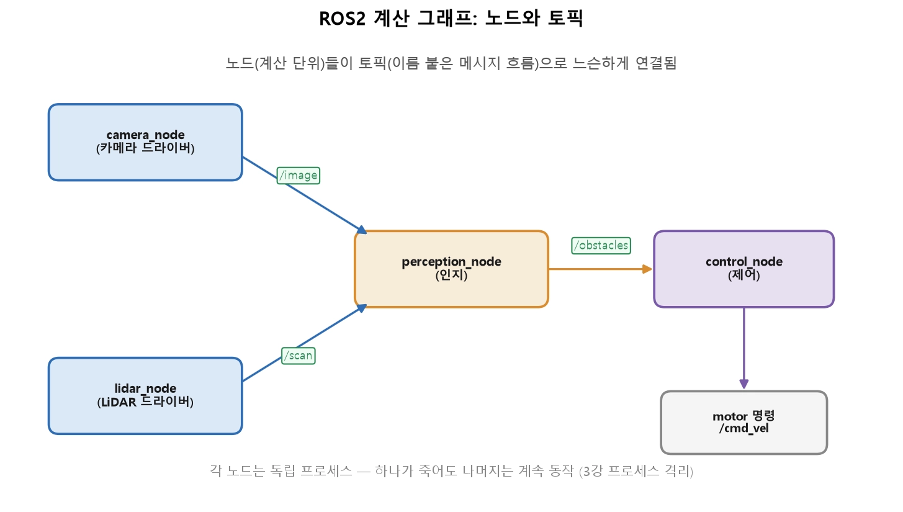
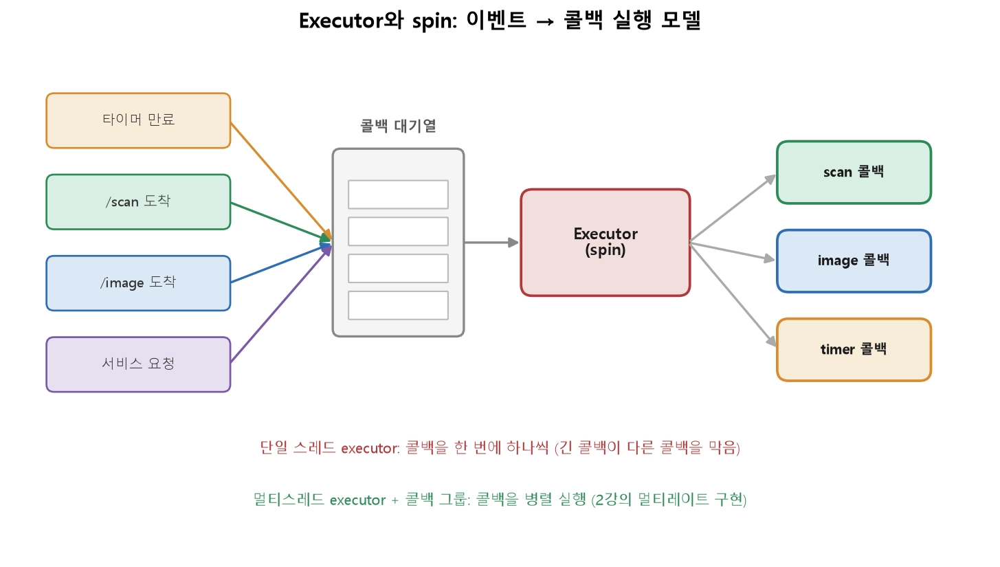

* 데이터 타입 별 size(bytes)

*** ROS2 노드와 실행 모델 (콜백·executor·spin·멀티스레딩)

** 1. 계산 그래프 — 노드와 토픽

* ROS2 시스템은 노드(node) 들이 토픽(topic) 으로 연결된 그래프입니다.
  
  - 해석: 각 노드는 하나의 일을 하는 프로그램입니다(카메라 드라이버, 인지, 제어…). 노드들은 서로를 직접 부르지 않고, 토픽이라는 이름 붙은 메시지 흐름으로 연결됩니다. camera_node가 /image 토픽에 영상을 발행(publish) 하면, perception_node가 그것을 구독(subscribe) 해 받습니다. 인지 결과는 다시 /obstacles 토픽으로 제어에 전달됩니다.

* 발행자는 누가 받는지 모릅니다. /image를 구독하는 노드가 0개든 5개든(인지·녹화·시각화…) 카메라 노드 코드는 그대로입니다.
* 노드는 독립 프로세스입니다. 프로세스 격리 덕분에, 인지 노드가 죽어도 제어·안전 노드는 계속 돕니다.
* 언어·위치 무관: C++ 노드와 Python 노드가 한 토픽으로 대화하고, 심지어 다른 컴퓨터의 노드와도 같은 방식으로 통신합니다.

|용어|의미|비유|
|:---:|:---:|:---:|
|노드(Node)|하나의 일을 하는 실행 단위(프로세스)|부서|
|토픽(Topic)|이름 붙은 단방향 메시지 흐름|사내 공지 채널|
|메시지(Message)|토픽으로 오가는 데이터의 형식|정해진 양식의 문서|
|발행/구독(Pub/Sub)|토픽에 쓰기 / 토픽에서 읽기|게시 / 구독|

<pre><code>
ros2 node list                 # 실행 중인 노드 목록
ros2 topic list                # 토픽 목록
ros2 topic echo /scan          # 토픽에 흐르는 메시지 실시간 출력
ros2 topic hz /scan            # 발행 주파수 측정 (2강의 주기!)
rqt_graph                      # 그래프를 시각적으로 표시
</code></pre>

** 2. 모든 것은 콜백 — 이벤트 구동 모델
- ROS2 노드의 코드는 위에서 아래로 순차 실행되는 스크립트가 아닙니다. "어떤 일이 생기면 이 함수를 불러라" 를 등록해 두는 이벤트 구동(event-driven) 방식입니다. 이 "이 함수"가 콜백(callback) 입니다.
* 구독 콜백: 구독 중인 토픽에 메시지가 도착하면 실행 (예: /scan이 오면 장애물 계산)
* 타이머 콜백: 정해진 주기마다 실행 (예: 20ms마다 제어 명령 발행)
* 서비스 콜백: 다른 노드가 요청을 보내면 실행

<pre><code>
class PerceptionNode(Node):
    def __init__(self):
        super().__init__('perception_node')
        # "/scan이 오면 self.on_scan을 불러라"
        self.sub = self.create_subscription(LaserScan, '/scan', self.on_scan, 10)
        # "/obstacles로 발행할 통로를 연다"
        self.pub = self.create_publisher(Obstacles, '/obstacles', 10)
        # "50ms마다 self.on_timer를 불러라"
        self.timer = self.create_timer(0.05, self.on_timer)

    def on_scan(self, msg):        # 구독 콜백
        self.latest_scan = msg     # 받아서 저장만 (빠르게!)

    def on_timer(self):            # 타이머 콜백
        result = detect_obstacles(self.latest_scan)
        self.pub.publish(result)   # 결과 발행
</code></pre>
- 구독 콜백은 받아서 저장만 하고(빠르게 끝냄), 무거운 처리는 타이머 콜백에서 자기 주기로 합니다. "빠른 루프는 느린 루프를 기다리지 않는다"가 이 구조입니다.
- 핵심: 노드를 만든다는 것은 "어떤 이벤트에 어떤 콜백을 붙일지 등록하는 것" 입니다. 그런데 이 콜백들을 실제로 누가, 언제, 어떤 순서로 부를까요? 그 주체가 executor입니다.

** 3. Executor와 spin — 콜백을 실제로 돌리는 엔진
- 노드를 만들고 콜백을 등록하기만 하면 아무 일도 일어나지 않습니다. 마지막에 반드시 이 한 줄이 필요합니다.
- spin은 executor에게 "이제 일을 시작하라"고 말하는 것입니다. executor는 다음 일을 무한 반복합니다.
<pre><code>
rclpy.spin(node)        # 이벤트를 기다리며 콜백을 계속 실행 (블로킹)
</code></pre>

- 해석: 타이머 만료, 토픽 도착, 서비스 요청 같은 이벤트가 생기면 그에 붙은 콜백이 대기열에 들어갑니다. executor는 spin 루프를 돌며 준비된 콜백을 대기열에서 꺼내 실행합니다. 기본인 단일 스레드 executor는 한 번에 하나씩만 실행하고, 멀티스레드 executor는 여러 콜백을 병렬로 실행합니다.

** 4. 단일 스레드의 함정 — 콜백 블로킹
- 기본 executor는 단일 스레드입니다. 콜백을 한 번에 하나만 실행하지요. 대부분의 경우 충분하지만, 한 콜백이 오래 걸리면 다른 콜백이 전부 밀립니다.

- 구체적 사고 실험입니다. 인지 콜백이 무거운 이미지 처리로 80ms가 걸린다고 합시다. 그동안:
* 20ms마다 돌아야 할 제어 타이머 콜백이 실행되지 못합니다.
* 제어 주기가 20ms → 80ms로 무너지고, 2강에서 배운 대로 제어가 불안정해집니다.
- 이것이 콜백 블로킹이며, ROS2 초심자가 겪는 가장 흔한 성능 문제입니다. 증상은 "제어가 갑자기 버벅인다", 원인은 "같은 executor의 어떤 콜백이 오래 잡고 있다"입니다.
- 1차 예방책: 콜백은 짧게 유지합니다. 콜백 안에서 sleep, 블로킹 I/O, 무한 대기(다른 서비스 응답을 콜백 안에서 기다리기)를 하지 않습니다. 무거운 일은 잘게 나누거나 별도 스레드/executor로 뺍니다.

** 5. 멀티스레드 executor와 콜백 그룹
- 여러 콜백을 동시에 돌리려면 멀티스레드 executor를 씁니다. 그러면 무거운 인지 콜백이 도는 동안에도 제어 타이머 콜백이 다른 스레드에서 제때 실행됩니다

<pre><code>
from rclpy.executors import MultiThreadedExecutor
executor = MultiThreadedExecutor(num_threads=4)
executor.add_node(node)
executor.spin()
</code></pre>

- 하지만 병렬 실행에는 콜백 그룹(callback group) 이라는 제어 장치가 필요합니다.
* MutuallyExclusive(상호 배타) 그룹: 이 그룹의 콜백들은 서로 동시에 실행되지 않습니다. 같은 데이터를 만지는 콜백들을 묶어 경쟁 상태(race condition) 를 막습니다.
* Reentrant(재진입) 그룹: 자유롭게 병렬 실행됩니다. 서로 독립적인 콜백에 씁니다.
- 예를 들어 제어 콜백과 인지 콜백을 다른 그룹에 두면 병렬로 돌아 제어가 인지에 막히지 않습니다. 반면 같은 상태 변수를 쓰는 콜백 둘은 같은 상호 배타 그룹에 두어 동시 접근을 막습니다.

- - 경쟁 상태와 왜 병렬이 공짜가 아닌가
    
    멀티스레드는 성능을 주지만 새로운 버그 유형을 데려옵니다. 두 콜백이 동시에 같은 변수를 읽고 쓰면 값이 꼬이는 **경쟁 상태(race condition)** 가 생깁니다.
    <pre><code>
    # 위험: on_scan(스레드 A)과 on_timer(스레드 B)가 동시에 latest_scan을 만짐
    def on_scan(self, msg):   self.latest_scan = msg          # 쓰는 중에
    def on_timer(self):       process(self.latest_scan)       # 읽으면? 반쯤 갱신된 값
    </code></pre>
    해법은 두 가지 방향입니다. ① 두 콜백을 같은 상호 배타 콜백 그룹에 넣어 동시 실행 자체를 막거나, ② 공유 데이터를 락(mutex) 으로 보호하는 것입니다. C++의 std::mutex, std::lock_guard가 후자입니다.

- - spin의 변형들
    rclpy.spin(node) 외에 상황별 변형이 있습니다.
    * spin_once(node, timeout_sec=...): 대기 중인 콜백을 한 번만 처리하고 반환. 다른 루프(예: 게임 루프, GUI)와 통합할 때.
    * spin_until_future_complete(node, future): 특정 비동기 작업(서비스 응답 등)이 끝날 때까지 spin. 11강 서비스 클라이언트에서 씁니다.
    이 변형들을 이해하면 "왜 서비스 요청을 콜백 안에서 기다리면 데드락이 나는가"(단일 스레드에서 spin 안의 콜백이 다시 spin을 기다리는 자기 잠금) 같은 함정을 피할 수 있습니다.

* 

<pre><code>
</code></pre>