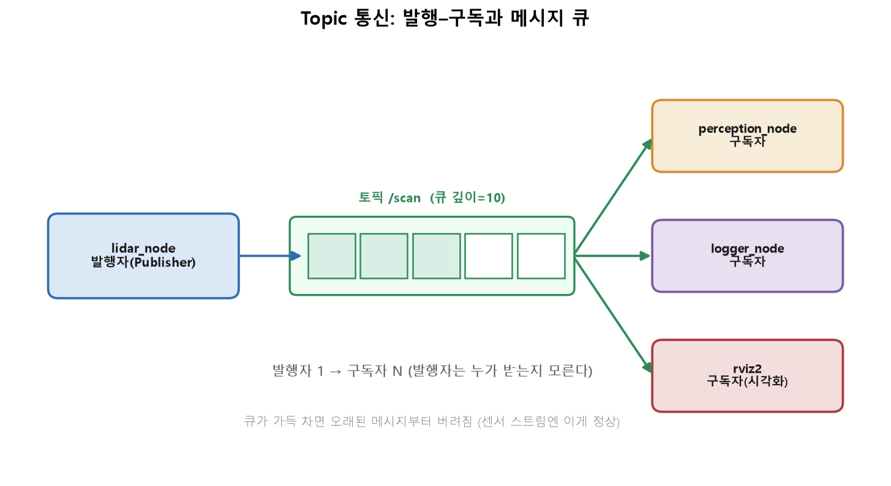
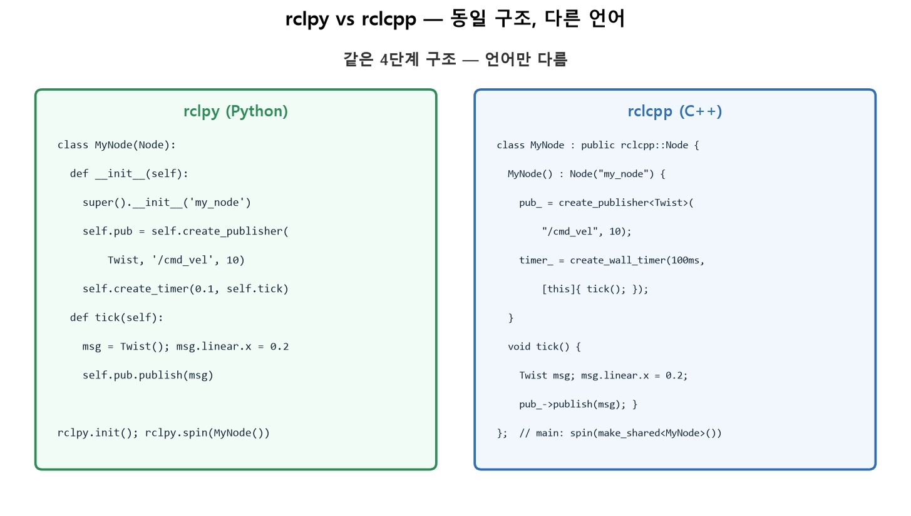
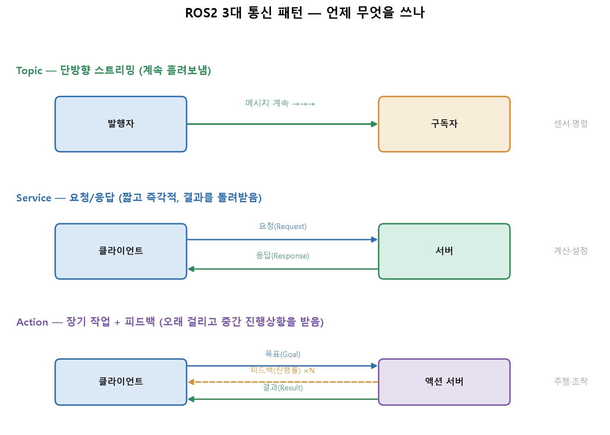
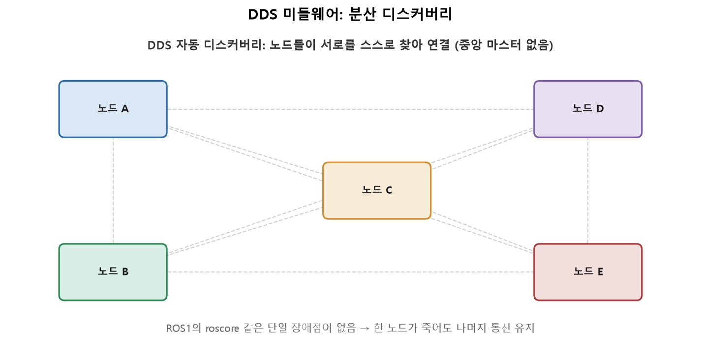
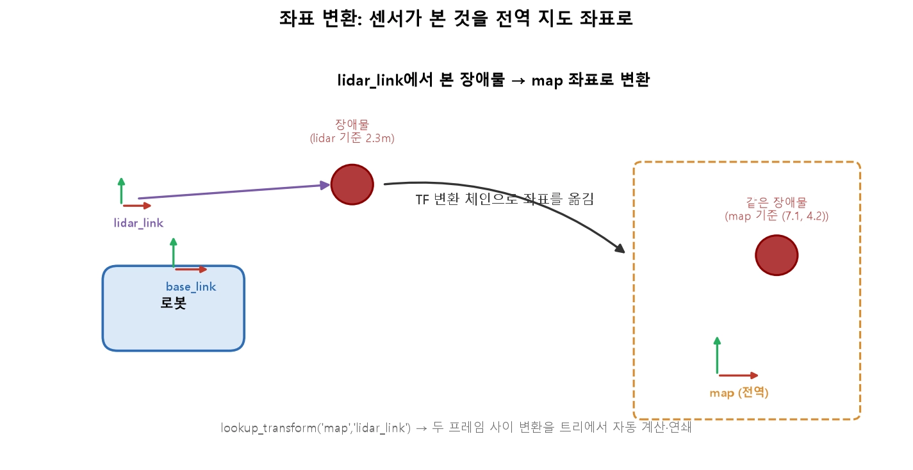

*** Topic 통신과 노드 작성 (pub/sub, rclpy·rclcpp)
 - Topic 통신은 ROS2에서 가장 많이 쓰이는 통신 방식이며 — 센서 스트림, 제어 명령, 상태 방송이 전부 토픽입니다

** 1. Topic 통신 모델 — 발행과 구독
 - Topic은 단방향, 비동기, 다대다 통신입니다. 발행자가 토픽에 메시지를 흘려보내면, 그 토픽을 구독한 모든 노드가 각자 받습니다.

 - 해석: 발행자(lidar_node)가 /scan 토픽에 메시지를 넣으면, 이를 구독한 여러 노드(인지·로거·시각화)가 각자 복사본을 받습니다. 발행자는 구독자가 누구인지, 몇 명인지 모릅니다(9강의 느슨한 결합). 토픽에는 메시지 큐가 있고, 큐 깊이(depth) 만큼 최근 메시지를 버퍼링합니다. 큐가 가득 차면 오래된 것부터 버려집니다.

* Topic이 맞는 경우: 센서 스트림, 상태 방송, 제어 명령처럼 계속 흘려보내는 데이터. "받는 쪽이 있든 없든 계속 발행".
* Topic이 아닌 경우: "이 값을 계산해서 결과를 돌려줘"(→ Service), "오래 걸리는 작업을 시키고 진행상황을 받아"(→ Action).
* 센서 스트림(빠른 데이터): 깊이를 작게(예: 1~10). 늦게 처리할 바엔 최신 것만 보는 게 낫습니다. 오래된 LiDAR 스캔은 쓸모없으니까요.
* 놓치면 안 되는 명령: 깊이를 충분히. 다만 신뢰성은 큐 깊이보다 QoS 정책에서 본격적으로 다룹니다.

** 2. 메시지 타입 — 통신의 양식
 - 노드끼리 데이터를 주고받으려면 형식이 정해진 양식이 필요합니다. 이것이 메시지 타입(인터페이스) 입니다. ROS2는 자주 쓰는 표준 메시지를 제공합니다.
|패키지|대표 메시지|용도|
|:---:|:---:|:---:|
|std_msgs|String, Float64, Bool|단순 값|
|geometry_msgs|Twist, Pose, Point|속도·자세·위치|
|sensor_msgs|LaserScan, Image, Imu|센서 데이터|
|nav_msgs|Odometry, Path|주행 정보|

<pre><code>
Twist
├── linear:  {x, y, z}    # 병진 속도 [m/s]
└── angular: {x, y, z}    # 회전 속도 [rad/s]
</code></pre>
 - /cmd_vel 토픽에 Twist를 발행하는 것이 ROS2에서 로봇을 움직이는 표준 방식입니다 — linear.x로 전진, angular.z로 회전. 표준 메시지를 쓰면 다른 팀·다른 로봇의 노드와도 바로 호환됩니다.

** 3. 발행자 노드 만들기 (rclpy)
 - 20Hz로 전진 명령을 발행하는 노드를 작성합니다.
<pre><code>
import rclpy
from rclpy.node import Node
from geometry_msgs.msg import Twist

class VelocityPublisher(Node):
    def __init__(self):
        super().__init__('velocity_publisher')      # 노드 이름
        # 발행자 생성: (메시지타입, 토픽명, 큐깊이)
        self.pub = self.create_publisher(Twist, '/cmd_vel', 10)
        # 0.05초(20Hz)마다 tick 호출
        self.timer = self.create_timer(0.05, self.tick)
        self.get_logger().info('발행 시작')

    def tick(self):
        msg = Twist()
        msg.linear.x = 0.2      # 0.2 m/s 전진
        msg.angular.z = 0.1     # 약간 회전
        self.pub.publish(msg)

def main():
    rclpy.init()
    node = VelocityPublisher()
    rclpy.spin(node)            # 콜백이 돌기 시작
    rclpy.shutdown()

if __name__ == '__main__':
    main()
</code></pre>

** 4. 구독자 노드 만들기 (rclpy)
 - 발행된 /cmd_vel을 받아 출력하는 구독자입니다.
<pre><code>
import rclpy
from rclpy.node import Node
from geometry_msgs.msg import Twist

class VelocitySubscriber(Node):
    def __init__(self):
        super().__init__('velocity_subscriber')
        # 구독자 생성: (메시지타입, 토픽명, 콜백, 큐깊이)
        self.sub = self.create_subscription(
            Twist, '/cmd_vel', self.on_cmd, 10)

    def on_cmd(self, msg):       # 메시지가 올 때마다 호출
        self.get_logger().info(
            f'받음: 전진 {msg.linear.x:.2f} m/s, 회전 {msg.angular.z:.2f} rad/s')

def main():
    rclpy.init()
    rclpy.spin(VelocitySubscriber())
    rclpy.shutdown()

if __name__ == '__main__':
    main()
</code></pre>
 - 핵심은 create_subscription에 콜백 함수를 등록하는 것입니다. 이후 메시지가 도착할 때마다 executor가 on_cmd를 불러 줍니다.
 - 구독 콜백은 짧게. 여기서는 로그만 찍지만, 실제 인지 처리라면 받아서 저장만 하고 무거운 계산은 타이머 콜백에 두는 패턴을 씁니다.

** 5. C++로는 어떻게 다를까요? (rclcpp)
 - 같은 노드를 C++로 쓰면 문법은 달라도 구조는 완전히 동일합니다.

 - 해석: 양쪽 모두 ① Node 상속 → ② 발행자/구독자 생성 → ③ 콜백 정의 → ④ spin 의 4단계입니다. 클래스 상속(: public rclcpp::Node), 템플릿(create_publisher<Twist>), 그리고 노드가 shared_ptr로 관리된다는 점(make_shared<MyNode>()). 즉 C++ 기초가 ROS2 코드를 읽는 열쇠였던 것입니다.
<pre><code>
#include "rclcpp/rclcpp.hpp"
#include "geometry_msgs/msg/twist.hpp"
using namespace std::chrono_literals;

class VelocityPublisher : public rclcpp::Node {
public:
    VelocityPublisher() : Node("velocity_publisher") {
        pub_ = create_publisher<geometry_msgs::msg::Twist>("/cmd_vel", 10);
        timer_ = create_wall_timer(50ms, [this]{ tick(); });
    }
private:
    void tick() {
        geometry_msgs::msg::Twist msg;
        msg.linear.x = 0.2;
        pub_->publish(msg);
    }
    rclcpp::Publisher<geometry_msgs::msg::Twist>::SharedPtr pub_;
    rclcpp::TimerBase::SharedPtr timer_;
};

int main(int argc, char** argv) {
    rclcpp::init(argc, argv);
    rclcpp::spin(std::make_shared<VelocityPublisher>());  // shared_ptr!
    rclcpp::shutdown();
}
</code></pre>
 - 언제 어느 언어를 쓸까요? 인지·프로토타이핑은 rclpy, 고빈도 제어·성능 노드는 rclcpp. 중요한 것은 둘이 같은 토픽으로 자유롭게 통신한다는 점 — Python 발행자와 C++ 구독자가 아무 문제 없이 대화합니다.

** 6. 실행과 확인 — CLI로 들여다보기
<pre><code>
# 두 개의 터미널에서 (각각 source 후)
ros2 run my_package velocity_publisher
ros2 run my_package velocity_subscriber

# 다른 터미널에서 관찰
ros2 topic list                    # /cmd_vel 이 보이는지
ros2 topic echo /cmd_vel           # 실제 메시지 내용 출력
ros2 topic hz /cmd_vel             # 20Hz로 나오는지 (2강의 주기 검증!)
ros2 topic info /cmd_vel           # 발행자·구독자 수
</code></pre>
 - 심지어 노드를 짜지 않고도 CLI로 직접 발행해 로봇을 움직여 볼 수 있습니다 — 디버깅의 강력한 무기입니다.

심화 — 패키지와 진입점: 노드는 어떻게 ros2 run으로 실행되나
 - ros2 run 패키지명 노드명이 동작하려면, 노드가 패키지로 등록되고 진입점(entry point) 이 선언돼야 합니다.
* Python 패키지: setup.py의 entry_points에 'velocity_publisher = my_package.pub_node:main' 등록.
* C++ 패키지: CMakeLists.txt에서 add_executable + install(TARGETS ...).
 - 그리고 이 패키지들을 빌드하는 것이 colcon build입니다. 지금은 "노드 하나가 곧바로 실행되는 게 아니라, 패키지로 묶여 빌드·설치된 뒤 실행된다"는 흐름만 잡아두면 됩니다.

** 11강. Service·Action·Parameter 통신
** 1. 세 가지 통신 패턴 — 큰 그림

 - Topic: 발행자가 구독자에게 계속 흘려보내는 단방향 스트림. 응답이 없습니다. → 센서·명령.
 - Service: 클라이언트가 서버에 요청하고 응답을 돌려받는 왕복 통신. 짧고 즉각적. → 계산·질의·설정.
 - Action: 오래 걸리는 작업에 목표를 주고, 중간 피드백을 받으며, 끝나면 결과를 받는 구조. 취소도 가능. → 주행·조작.

|질문|답 → 패턴|
|:---:|:---:|
|결과를 돌려받아야 하나?|아니오(그냥 보냄) → Topic|
|결과를 돌려받되, 즉시 끝나나?|예 → Service|
|오래 걸리고, 진행상황·취소가 필요한가?|예 → Action|
|노드의 설정값을 다루나?|예 → Parameter|

 - 핵심: 통신 패턴 선택은 설계의 첫 단추입니다. "주행 명령"을 Service로 만들면 로봇이 목적지 도착까지 클라이언트를 몇 분간 붙잡아 두는 재앙이 됩니다. 반대로 "덧셈 계산"을 Action으로 만들면 과한 복잡성입니다.

** 2. Service — 요청과 응답
 - Service는 한 번의 요청 → 한 번의 응답입니다. 서버가 요청을 처리하는 동안 클라이언트는 결과를 기다립니다. 짧고 확실히 끝나는 일에 씁니다.
 - 예: "현재 지도를 저장해줘", "이 관절 각도로 순기구학 계산해줘", "로봇을 재보정해줘"

* 서비스는 .srv 인터페이스로 정의되며, ---로 요청과 응답을 나눕니다.
<pre><code>
# AddTwoInts.srv
int64 a          # 요청(Request)
int64 b
---
int64 sum        # 응답(Response)
</code></pre>
* 서버 쪽(rclpy) — 요청이 오면 콜백이 응답을 채워 돌려줍니다.
<pre><code>
class AddServer(Node):
    def __init__(self):
        super().__init__('add_server')
        self.srv = self.create_service(AddTwoInts, 'add_two_ints', self.on_request)

    def on_request(self, request, response):
        response.sum = request.a + request.b
        return response          # 이 값이 클라이언트로 돌아감
</code></pre>
* 클라이언트 쪽 — 여기에 중요한 함정이 있습니다.
<pre><code>
future = client.call_async(request)                 # 비동기 요청
rclpy.spin_until_future_complete(node, future)      # 응답까지 spin
result = future.result()
</code></pre>
 - 함정: 서비스 응답을 콜백 안에서 동기로 기다리지 마세요. 배운 대로, 단일 스레드 executor에서 콜백이 서비스 응답을 기다리면 — 그 응답을 처리할 spin이 이미 콜백에 붙잡혀 있어서 — 영원히 서로를 기다리는 데드락이 됩니다. 그래서 call_async(비동기)를 쓰고, 응답 처리는 별도 콜백이나 spin_until_future_complete로 합니다. 이것이 "콜백은 짧게, 콜백 안에서 대기 금지" 원칙의 구체적 사례입니다.
* CLI로도 서비스를 호출할 수 있습니다.
<pre><code>
ros2 service list
ros2 service call /add_two_ints example_interfaces/srv/AddTwoInts "{a: 3, b: 4}"
</code></pre>

** 3. Action — 장기 작업 + 피드백 + 취소
 - 로봇의 대표 작업들 — 목적지까지 주행, 물체 집기, 특정 자세로 이동 — 은 몇 초에서 몇 분 걸립니다. 이때 Service를 쓰면 그동안 아무 정보도 없이 하염없이 기다려야 하고, 중간에 멈출 수도 없습니다. Action은 이 문제를 위해 설계됐습니다.

 - 해석: ① 클라이언트가 목표(Goal) 를 보내면, ② 서버가 수락 또는 거부합니다(예: 이미 다른 목표 수행 중이면 거부). ③ 수행하는 동안 서버는 피드백(Feedback) 을 반복 전송합니다(남은 거리, 진행률). ④ 완료되면 결과(Result) 를 돌려줍니다. 그리고 언제든 클라이언트가 취소를 요청하면 서버가 안전하게 중단합니다.
 - 구조적으로 Action은 Service(목표/결과) + Topic(피드백 스트림) 을 합친 것입니다. .action 인터페이스는 세 부분입니다.
<pre><code>
# NavigateToPose.action (개념 예시)
geometry_msgs/Pose target      # Goal: 목표 지점
---
bool success                   # Result: 성공 여부
---
float32 distance_remaining     # Feedback: 남은 거리 (반복 전송)
</code></pre>
 - Action이 진가를 발휘하는 대표 사례가 Nav2 자율주행(Level 2)입니다. "현관으로 가"라는 목표를 주면, 로봇이 수십 초간 이동하며 남은 거리를 피드백하고, 사람이 갑자기 나타나 "멈춰"를 누르면 취소로 안전하게 정지합니다. 이 모든 것이 Action 한 패턴으로 표현됩니다.
 - 취소가 왜 중요할까요? 로봇은 물리적으로 움직이는 중입니다(2강의 실시간·안전). "지금 당장 멈춰야 하는" 상황에서 작업을 중단하고 안전 상태로 되돌리는 능력은 안전 설계의 핵심입니다. Topic·Service엔 없는 Action만의 필수 기능입니다.

** 4. Parameter — 런타임 설정값
 - 로봇 노드에는 조정 가능한 설정값이 많습니다 — 최대 속도, 제어 게인(모듈 ③의 PID!), 센서 프레임률, 안전 거리. 이를 코드에 하드코딩하지 않고 Parameter로 다루면, 재빌드 없이 값을 바꾸고 실행 중에도 조정할 수 있습니다.
<pre><code>
class ControlNode(Node):
    def __init__(self):
        super().__init__('control_node')
        self.declare_parameter('max_speed', 0.8)          # 선언 + 기본값
        self.declare_parameter('kp', 1.2)

    def tick(self):
        max_speed = self.get_parameter('max_speed').value  # 조회
</code></pre>
<pre><code>
ros2 param list                                  # 파라미터 목록
ros2 param get /control_node max_speed           # 값 조회
ros2 param set /control_node max_speed 0.5       # 실행 중 변경!
</code></pre>

 - Parameter의 진짜 힘은 런치 파일과 결합할 때 드러납니다(15강). 같은 노드를 실내용(느린 속도)과 실외용(빠른 속도) 설정으로 각각 실행하는 것을, 코드 수정 없이 파라미터 파일만 바꿔 할 수 있습니다. 모듈 ③에서 PID 게인을 튜닝할 때 이 방식이 특히 유용합니다 — 코드를 다시 빌드하지 않고 게인을 실시간으로 조정하며 응답을 관찰할 수 있으니까요.

 - - 심화 — 왜 Topic으로 요청/응답을 흉내 내면 안 될까
 - "요청 토픽"과 "응답 토픽" 두 개를 만들어 Service를 흉내 낼 수도 있습니다. 실제로 초보자들이 시도합니다. 하지만 문제가 생깁니다.
 - * 요청과 응답의 짝을 맞출 수 없음: 여러 요청이 동시에 오가면 "이 응답이 어느 요청의 것인지" 알 수 없습니다. Service는 이 매칭을 내부적으로 보장합니다.
 - * 서버 존재 확인 불가: Service 클라이언트는 wait_for_service()로 서버가 준비됐는지 알 수 있습니다. Topic은 구독자 유무를 발행자가 모릅니다(느슨한 결합의 이면).
 - 즉 통신 패턴은 단순한 편의가 아니라 의미론(semantics)의 보장입니다. "왕복이 필요하면 Service, 스트림이면 Topic"을 지키는 것이 견고한 설계입니다.

*** 13강. QoS 정책과 DDS 미들웨어

** 1. DDS — ROS2 통신의 토대
 - ROS2의 모든 통신은 실제로는 **DDS(Data Distribution Service)** 라는 산업 표준 미들웨어 위에서 일어납니다. 우리가 `create_publisher`를 부르면, 그 아래에서 DDS가 실제 네트워크 통신을 담당합니다.
 - DDS의 가장 중요한 특징은 **분산 디스커버리**입니다.

 - 해석: ROS2에는 중앙 관리자(마스터)가 없습니다. 노드들이 네트워크에서 서로를 자동으로 발견해 직접 연결합니다. ROS1에는 roscore라는 중앙 관리자가 있어서 그것이 죽으면 전체 통신이 마비됐지만(단일 장애점), ROS2/DDS는 그 약점을 없앴습니다. 한 노드가 죽어도 나머지는 계속 통신합니다 — 로봇의 견고함에 중요한 성질입니다.
 - 참고: DDS 구현체는 여러 개(Fast DDS, Cyclone DDS 등)가 있고, 환경변수 RMW_IMPLEMENTATION으로 교체할 수 있습니다. 보통은 기본값을 쓰지만, 성능 튜닝 시 바꾸기도 합니다.

** 2. QoS 핵심 정책
 - QoS는 여러 설정의 묶음(프로파일)입니다. 로봇에서 가장 중요한 세 가지를 봅니다.
   ### Reliability — 신뢰성
   메시지가 유실됐을 때 어떻게 할지 정합니다.
   
   해석: (왼쪽) Reliable은 유실 시 재전송해 반드시 도착시킵니다 — 확실하지만 지연이 늘 수 있습니다. Best-Effort는 유실을 허용하고 최신 것을 빠르게 보냅니다 — 빠르지만 일부 누락됩니다. (오른쪽) 발행자와 구독자의 설정이 호환되어야 연결됩니다.
   * Reliable(신뢰성): 명령, 설정, 상태 변경처럼 놓치면 안 되는 데이터. 예) /cmd_vel, 목표 지점.
   * Best-Effort(최선 노력): 센서 스트림처럼 최신이 중요하고 일부 유실은 무방한 데이터. 예) 카메라 영상, LiDAR 스캔. 늦게 도착할 오래된 프레임을 재전송하느니 버리는 게 낫습니다.
   
   ### Durability — 지속성
   구독자가 늦게 접속했을 때, 그 전에 발행된 메시지를 받을지 정합니다.
   * Volatile(휘발성): 접속 후 오는 메시지만 받습니다. 대부분의 스트림.
   * Transient Local(지속): 발행자가 마지막 메시지를 보관했다가, 늦게 온 구독자에게도 전달합니다. 예) 지도(/map), 로봇 설명(/robot_description) — 한 번 발행되고 잘 안 바뀌지만, 나중에 접속한 노드도 반드시 알아야 하는 데이터입니다.

   ### History — 이력(큐)
   버퍼링 정책입니다.
   * Keep Last (depth N): 최근 N개만 보관. 가장 일반적.
   * Keep All: 가능한 한 모두 보관(자원 한도 내).

** 3. 미리 정의된 QoS 프로파일
 - 매번 세부 설정을 조합하긴 번거로우므로, ROS2는 용도별 프로파일을 제공합니다.
|프로파일|구성|용도|
|:---:|:---:|:---:|
|Default|Reliable, Volatile, KeepLast(10)|일반 통신(명령 등)|
|Sensor Data|Best-Effort, Volatile, KeepLast(5)|카메라·LiDAR 스트림|
|Services|Reliable|서비스 통신|
|Parameters|Reliable|파라미터|
<pre><code>
from rclpy.qos import qos_profile_sensor_data

# 센서 데이터엔 전용 프로파일
self.sub = self.create_subscription(
    LaserScan, '/scan', self.on_scan, qos_profile_sensor_data)
</code></pre>
- 핵심: "센서 구독은 Sensor Data 프로파일, 명령은 Default(Reliable)"만 기억해도 대부분의 상황을 옳게 처리합니다.

** 4. QoS 호환성 — "토픽은 맞는데 왜 연결이 안 되지?"
 - ROS2 초심자를 가장 당황시키는 문제입니다. 토픽 이름도 메시지 타입도 똑같은데 데이터가 안 흐릅니다. 원인은 십중팔구 **QoS 불일치**입니다.

 - 규칙의 핵심은 **"구독자의 요구가 발행자보다 엄격하면 연결되지 않는다"** 입니다.
  * 발행자 Best-Effort + 구독자 Reliable → 연결 안 됨 (구독자가 "반드시 재전송해줘"를 요구하는데 발행자가 그럴 능력이 없음)
  * 발행자 Reliable + 구독자 Best-Effort → 연결됨 (구독자가 덜 까다로움)
 - 가장 흔한 실수가 바로 이것입니다. 센서 노드(Best-Effort 발행) 를 만들었는데, 구독자를 기본값(Reliable)으로 만들면 연결이 안 됩니다. 데이터는 흐르는데 내 노드만 못 받는 상황이 벌어집니다.
<pre><code>
ros2 topic info /scan --verbose    # 발행자·구독자의 QoS를 상세 표시
</code></pre>
QoS가 서로 맞는지 여기서 확인합니다. "토픽은 맞는데 안 온다"의 절반 이상이 이 명령 한 줄로 풀립니다.

- **심화** — Deadline·Liveliness: 살아있음을 감시하는 QoS
    
    로봇 안전에 직결되는 고급 QoS도 있습니다.
    * Deadline: "이 토픽은 최소 X ms마다 갱신되어야 한다"는 계약. 어기면 콜백으로 알려 줍니다. 예) 센서가 100ms 안에 갱신 안 되면 "센서 고장?" 처리를 발동. 주기·마감 개념이 통신 계층으로 올라온 것입니다.
    * Liveliness: 발행자가 "나 살아있다"를 주기적으로 알리고, 끊기면 구독자가 감지. 노드·센서의 생존 감시에 씁니다.
    이 정책들은 "통신이 조용한 것이 정상인지, 고장인지"를 구분하게 해 줍니다 — 침묵이 데이터 없음인지 장애인지 아는 것은 안전 설계의 핵심입니다.

*** 14강. TF2 좌표 변환
** 1. 왜 좌표계가 여러 개일까요?
 - 각 부품·센서는 자기만의 기준점에서 세상을 봅니다.
  * LiDAR는 자기 위치를 원점으로 거리를 잽니다.
  * 카메라는 렌즈 중심을 원점으로 픽셀을 봅니다.
  * 바퀴 제어는 로봇 몸체 중심을 기준으로 합니다.
  * 경로 계획은 방 전체(전역 지도)를 기준으로 합니다.
 - 이들을 하나로 통일할 수 없습니다. 대신 각각 좌표계를 두고, 그 사이의 변환 관계를 관리합니다. "LiDAR가 본 것"을 "로봇 몸체 기준"으로, 다시 "전역 지도 기준"으로 옮길 수 있으면 됩니다.

** 2. 좌표계 트리 — 표준 계층
 - ROS2는 좌표계들을 트리(tree) 로 구성합니다. 각 프레임은 부모를 하나 가지며, 부모에 대한 자신의 위치·자세(=변환)를 갖습니다.

 - 해석: 표준 계층은 위에서부터 map(전역 고정 좌표계) → odom(주행 기준) → base_link(로봇 몸체) → 센서들(lidar_link·camera_link·imu_link)입니다. 각 화살표가 프레임 간 변환(위치 + 회전)이며, 화살표 옆의 정보원(SLAM, 엔코더, 고정 장착)이 그 변환을 계산·제공합니다.
 - 각 프레임의 의미:
  * map: 방/건물에 고정된 전역 기준. 시간이 지나도 안 움직입니다. "절대 위치"의 기준.
  * odom: 로봇의 출발점 기준으로 엔코더(바퀴 회전)로 추정한 위치. 부드럽지만 시간이 지나면 오차가 누적됩니다(미끄러짐 등).
  * base_link: 로봇 몸체의 기준점. 모든 센서가 여기에 상대적으로 고정 장착됩니다.
  * 센서 링크들: 각 센서의 위치. base_link에 대해 고정(로봇에 나사로 박혀 있으니)입니다.
   - 왜 map과 odom을 나눌까요? odom은 엔코더 기반이라 부드럽지만 오차가 쌓입니다(연속적이나 부정확). map은 SLAM/AMCL(Level 2)로 가끔 튀지만 정확히 보정됩니다(불연속이나 정확). 제어는 부드러운 odom을, 경로 계획은 정확한 map을 씁니다. 2강에서 본 "빠른 것과 정확한 것의 분리"가 좌표계 설계에도 나타납니다.

** 3. 변환의 방향과 정적/동적
 - 각 변환은 부모→자식의 관계입니다. 변환은 두 종류로 나뉩니다.
  * 정적 변환(static): 시간이 지나도 안 바뀌는 관계. 예) base_link → lidar_link(센서가 로봇에 고정). 한 번 발행하면 됩니다.
  * 동적 변환(dynamic): 계속 바뀌는 관계. 예) odom → base_link(로봇이 움직이니까). 매 순간 새로 발행됩니다.
 - 로봇이 앞으로 1m 가면 odom→base_link 변환이 갱신되지만, base_link→lidar_link는 그대로입니다(센서는 몸에 붙어 함께 움직이니까). TF2는 이 둘을 구분해 효율적으로 관리합니다.

** 4. broadcast와 lookup — TF2의 두 동작
 - TF2 시스템은 두 가지 기본 동작으로 돌아갑니다.
  * broadcast(방송): 각 노드가 자기가 아는 변환을 /tf(동적)·/tf_static(정적) 토픽에 발행합니다. 예) 오도메트리 노드가 odom→base_link를, 로봇 상태 발행자가 base_link→센서들을 방송.
  * lookup(조회): 필요한 노드가 "지금 A 프레임에서 B 프레임으로 가는 변환이 뭐야?"를 질의합니다. TF2가 트리를 따라 중간 변환들을 연쇄해서 답을 계산합니다.
 - 방송하는 쪽 코드는 이렇게 생겼습니다. 로봇의 위치·자세를 아는 노드(오도메트리·시뮬레이터)가 매 주기 변환 하나를 채워 보냅니다.
<pre><code>
from tf2_ros import TransformBroadcaster
from geometry_msgs.msg import TransformStamped

class OdomBroadcaster(Node):
    def __init__(self):
        super().__init__('odom_broadcaster')
        self.br = TransformBroadcaster(self)
        self.create_subscription(Pose, '/pose', self.on_pose, 10)

    def on_pose(self, msg):
        t = TransformStamped()
        t.header.stamp = self.get_clock().now().to_msg()   # 언제의 변환인가
        t.header.frame_id = 'odom'                          # 부모 프레임
        t.child_frame_id = 'base_link'                      # 자식 프레임
        t.transform.translation.x = msg.x                   # 병진
        t.transform.translation.y = msg.y
        t.transform.rotation.z = math.sin(msg.theta / 2.0)  # 회전은 쿼터니언으로(20강)
        t.transform.rotation.w = math.cos(msg.theta / 2.0)
        self.br.sendTransform(t)
</code></pre>
 - 세 가지만 채우면 됩니다 — 부모·자식 프레임 이름, 타임스탬프, 변환값(병진+쿼터니언). 자세를 오일러 각으로 들고 있어도 TF2 에는 쿼터니언으로 넣어야 합니다(회전만 있는 2D 로봇이면 위처럼 z·w 두 성분으로 끝납니다).
 - 고정 장착된 센서처럼 변하지 않는 변환은 매 주기 보낼 필요가 없습니다. StaticTransformBroadcaster 로 한 번만 발행하면 /tf_static 에 남아 나중에 뜬 노드도 받습니다.

 - 해석: LiDAR가 lidar_link 기준으로 장애물을 감지했습니다. 이것을 전역 지도(map) 좌표로 옮기려면 lidar_link → base_link → odom → map의 변환을 차례로 연쇄해야 합니다. TF2의 lookup_transform('map', 'lidar_link')를 부르면, 이 중간 단계를 자동으로 찾아 곱해 최종 변환을 돌려줍니다. 우리는 프레임 이름 두 개만 주면 됩니다.
<pre><code>
# 개념 코드 (rclpy + tf2_ros)
from tf2_ros import TransformListener, Buffer

# lidar_link 기준 점을 map 기준으로 변환
transform = tf_buffer.lookup_transform(
    'map',           # 목표 프레임 (어디로)
    'lidar_link',    # 출발 프레임 (어디서)
    rclpy.time.Time())   # 시점
point_in_map = do_transform_point(point_in_lidar, transform)
</code></pre>
 - 이 자동 연쇄가 TF2의 핵심 가치입니다. 로봇에 프레임이 10개든 20개든, 우리는 "어디서 어디로"만 말하면 됩니다. 중간 경로 계산은 TF2가 트리 구조를 이용해 처리합니다.

** 5. 시각화와 디버깅
 - TF는 눈에 안 보여서 문제가 생기면 막막합니다. 다행히 도구가 있습니다.
<pre><code>
ros2 run tf2_tools view_frames        # 현재 TF 트리를 PDF로 그려줌
ros2 run tf2_ros tf2_echo map base_link   # 두 프레임 사이 변환을 실시간 출력
</code></pre>
 - 그리고 RViz2(16강)에서 TF를 3D로 표시하면, 각 좌표계가 공간에서 어떻게 배치되고 로봇과 함께 움직이는지 직접 볼 수 있습니다 — TF 디버깅의 가장 강력한 방법입니다.

심화 — 시간과 TF: "그때 그 좌표"를 묻는 이유
 - TF의 미묘하지만 중요한 특징은 시간입니다. 로봇은 계속 움직이므로, "지금"의 변환과 "0.1초 전"의 변환이 다릅니다.
 - 카메라가 0.1초 전에 찍은 영상에서 장애물을 방금 검출했다고 합시다. 이 장애물을 map으로 옮기려면 "영상을 찍은 그 시점"의 변환을 써야 합니다 — 지금 변환을 쓰면 그사이 로봇이 움직인 만큼 오차가 생깁니다. 그래서 lookup에 타임스탬프를 넘깁니다.
<pre><code>
transform = tf_buffer.lookup_transform('map', 'camera_link', image.header.stamp)
</code></pre>
 - 메시지에 Header(타임스탬프)를 넣은 이유입니다 — "언제 측정됐는가"가 있어야 올바른 좌표 변환이 가능합니다. TF2는 최근 변환들을 버퍼에 보관해 과거 시점 조회를 지원합니다. 시간·공간이 함께 얽히는 것이 로봇 인지의 어려움이자 정교함입니다.

* a
* a
* a
* a
* a
* a
* a

<pre><code>
</code></pre>

<pre><code>
</code></pre>
<pre><code>
</code></pre>